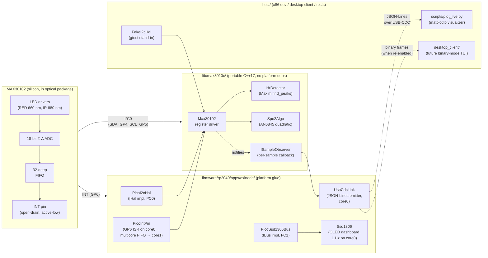
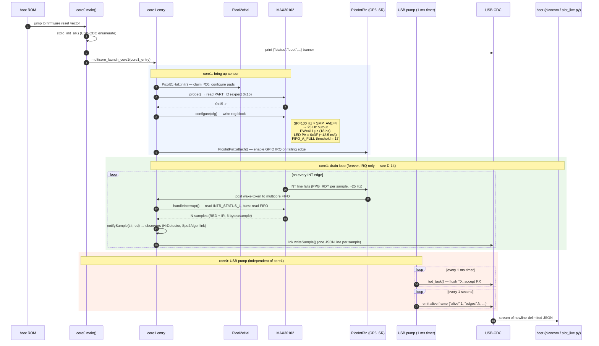
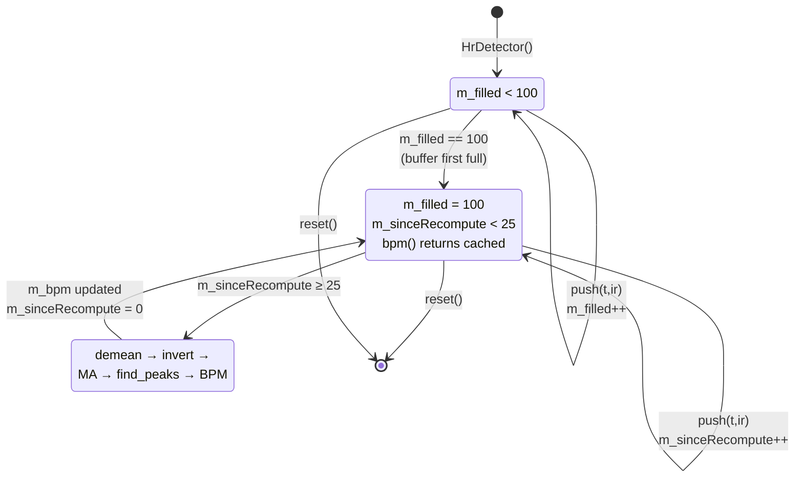
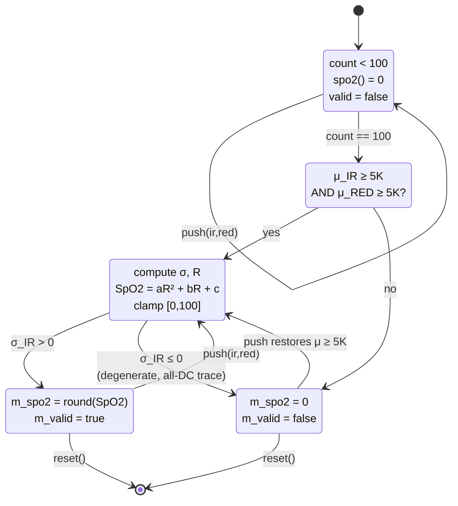

# OxiNode — Software theory of operation

> Companion to the source. Read this with the code open in another window:
> the headings name the files, the diagrams show how they call each other,
> and the math sections prove what the comments only summarise.
>
> For the *what* (modules, repository layout) see
> [`ARCHITECTURE.md`](ARCHITECTURE.md). For the *why* (decisions, tradeoffs)
> see [`DESIGN.md`](DESIGN.md). For the *wires* see
> [`HARDWARE.md`](HARDWARE.md). This document is the *how*.

---

## 1. System overview

OxiNode is three layers around one sensor:



The dotted arrows are protocol boundaries: `IHal` is the inner one (driver
↔ platform), USB-CDC is the outer one (firmware ↔ host).

An optional **0.96″ SSD1306 OLED** sits on **I²C1** (GP14/GP15, 400 kHz)
with its own portable driver in [`lib/ssd1306/`](../lib/ssd1306/). It
renders a `OxiNode / HR / SpO2` dashboard at 1 Hz off the latest values
core0 already has cached for the alive frame. The OLED is fully optional
— if init or flush fails the firmware logs once and keeps streaming
JSON-Lines normally. Its bus is hardware-isolated from the MAX30102's
I²C0, so a 25 ms full-frame flush cannot back-pressure the sensor drain.

---

## 2. Boot sequence — from power-up to the first JSON line



Key timing facts:

| Event | Cadence | Where in code |
|---|---|---|
| Sample produced by chip | 25 Hz (SR_100 ÷ AVG_4) | configured in `Max30102::Config` |
| `INT` line asserted (PPG_RDY) | 25 Hz — one per output sample | enabled in `Max30102::configure` |
| `INT` line asserted (A_FULL) | rare in practice — see footgun below | shares `INTR_ENABLE_1` with PPG_RDY |
| `handleInterrupt()` runs | per IRQ (pure-IRQ drain — no polling) | `core1_entry` in `main.cpp` |
| One JSON sample line | 25 lines/s with finger on | `UsbCdcLink::writeSample` |
| Alive frame | 1 Hz | core0 1 s timer |
| `HrDetector` recompute | 1 Hz once buffer is full | `kRecomputeEvery = kFs` |
| `Spo2Algo` update | per-sample (ratio is cheap) | `Spo2Algo::push` |

> **Pure-IRQ drain.** core1 calls `PicoIntPin::waitForInterrupt()`
> (blocking `multicore_fifo_pop_blocking`) and runs
> `handleInterrupt()` on every wake. The chip's `INTR_ENABLE_1`
> register has both `A_FULL` and `PPG_RDY` set; PPG_RDY fires every
> output sample, so the IRQ rate already matches the sample rate.
> The earlier 50 ms polled fallback (D-12) was redundant once that
> path was verified healthy and was retired — see
> [`DESIGN.md` § D-14](DESIGN.md#d-14--switched-back-to-irq-only-drain-after-bring-up).
> A wedged sensor now hangs core1's drain loop, but the alive frame
> on core0 keeps publishing `edges` / `int1` / `probe` / `cfg` so the
> host can see the stall.

> **Footgun in `Config::fifoAlmostFullThreshold`.** The field is
> typed `uint8_t` but the register only has 4 bits, and
> `Max30102.cpp:97` masks with `& 0x0F`. The default value `17` →
> truncates to `1` → A_FULL fires on a near-edge case (1 free space
> remaining or 1 entry in FIFO depending on which Maxim doc you
> trust). PPG_RDY is on, so this is invisible today. Tracked in
> D-14 for follow-up.

---

## 3. Per-sample data flow

The flow from "a photon hits the photodiode" to "a JSON line crosses USB":

```mermaid
flowchart TB
    photon([photon hits PD]) --> adc[Σ-Δ ADC integrates over PW=411 µs]
    adc --> avg["chip averages 4 samples (SMP_AVE=4)<br/>output rate = 25 Hz"]
    avg --> fifo["pushed onto 32-deep FIFO<br/>(6 bytes/entry: 3B RED + 3B IR)"]
    fifo --> afull{FIFO depth ≥<br/>A_FULL threshold?}
    afull -- no --> wait[wait for next sample]
    afull -- yes --> intpin["INT pin → low<br/>(open-drain)"]
    wait --> avg

    intpin --> isr["PicoIntPin::intIsrTrampoline<br/>(core1 GPIO IRQ)"]
    isr --> fifoq["multicore_fifo_push_blocking(token)"]
    fifoq --> drain["core1 wakes from<br/>multicore_fifo_pop_timeout_us"]
    drain --> hi["Max30102::handleInterrupt()<br/>1. read INTR_STATUS_1/2<br/>2. read FIFO_WR_PTR / RD_PTR<br/>3. burst-read N × 6 B from FIFO_DATA"]

    hi --> decode["decodeSpo2Entry()<br/>RED first, then IR<br/>both 18-bit, mask 0x3FFFF"]
    decode --> notify[["notifySample(tMs, ir, red)<br/>fan out to all ISampleObservers"]]

    notify --> hrpush["HrDetector::push(tMs, ir)<br/>append to ring buffer"]
    notify --> spo2push["Spo2Algo::push(ir, red)<br/>append + recompute R"]
    notify --> linkpush["UsbCdcLink::writeSample()<br/>format JSON line"]

    hrpush --> hrwhen{filled == 100<br/>AND<br/>sinceRecompute<br/>≥ 25?}
    hrwhen -- no --> hrcache[bpm() returns cached value]
    hrwhen -- yes --> hrrun[recompute → maxim_find_peaks → BPM]
    hrrun --> hrcache

    spo2push --> spowhen{count == 100?}
    spowhen -- no --> spocache[spo2() returns 0]
    spowhen -- yes --> sporun["DC mean + AC RMS + R<br/>→ AN6845 quadratic"]
    sporun --> spocache

    linkpush --> json[/"{\"t\":..., \"ir\":..., \"red\":..., \"hr\":..., \"spo2\":...}"/]
    hrcache -.read by.-> linkpush
    spocache -.read by.-> linkpush
    json --> usbout([USB-CDC TX → host])
```

The observer pattern (`ISampleObserver`, `lib/max3010x/include/max3010x/SampleObserver.hpp`)
is what keeps the driver portable. `Max30102::handleInterrupt` doesn't know
or care that one of its observers is a USB writer and another two are DSP
buffers — it just calls `onSample(tMs, ir, red)` on whatever's registered.

---

## 4. Heart-rate algorithm — the math

A direct port of Maxim's MAXREFDES117# reference algorithm
(`spo2_algorithm.cpp::maxim_heart_rate_and_oxygen_saturation`,
walked through in UG6409 §"Heart-Rate Post-Processing", p.29-30).
Code lives in `lib/max3010x/src/HrDetector.cpp`.

### 4.1 Inputs and constants

| Symbol | Code | Value | Meaning |
|---|---|---|---|
| $F_s$ | `kFs` | 25 Hz | post-AVG_4 chip output rate |
| $N$ | `kBufferSize` | 100 samples | 4-second analysis window |
| $M$ | `kMaSize` | 4 | moving-average tap count |
| $d_\text{min}$ | `kMinPeakDistance` | 4 samples | min peak separation (≈ 0.16 s → 375 BPM ceiling) |
| $h_\text{min}$ | `kMinPeakHeight` | 30 counts | absolute peak amplitude floor |
| $P_\text{max}$ | `kMaxPeaks` | 15 | max peaks per 4-second buffer |
| $T$ | `kRecomputeEvery` | 25 pushes | 1 Hz recompute cadence |

### 4.2 Pipeline

Let $x[k]$, $k = 0, \dots, N-1$ be the most recent $N$ raw IR ADC samples
(oldest first, after linearising the ring buffer in `recompute()`).

**Step 1 — DC mean.**

$$
\mu = \frac{1}{N} \sum_{k=0}^{N-1} x[k]
$$

`recompute()` lines computing `sum / n`. Stored in `int64_t` to keep
headroom against 18-bit values × 100 entries.

**Step 2 — Demean and invert.**

$$
y[k] = -(x[k] - \mu)
$$

The inversion is *essential*: a PPG systolic upstroke is a *valley* in the
IR-ADC trace (more arterial blood → more 880 nm absorption → less light to
the PD → lower count). Inverting turns valleys into peaks, so a generic
peak-finder works directly. Maxim spell this out in
`spo2_algorithm.cpp:111`.

**Step 3 — 4-tap moving-average smoother.**

$$
z[k] = \frac{1}{4}\bigl(y[k] + y[k+1] + y[k+2] + y[k+3]\bigr),
\quad k = 0, \dots, N-M-1
$$

The tail $z[N-M], \dots, z[N-1]$ is **zeroed** (not part of Maxim's
reference; we add it because at low BPM the un-smoothed tail produced
spurious peaks, see [`DESIGN.md` § D-13](DESIGN.md#d-13--replaced-homegrown-hr-detector-with-maxims-algorithmcpp-port-spo2-uses-an6845-calibrated-quadratic)).

**Step 4 — peak detection.** Find sample indices
$L = \{l_1 < l_2 < \dots < l_p\}$, $p \le P_\text{max}$, satisfying:

- $z[l_i] > h_\text{min}$
- $z[l_i] > z[l_i - 1]$ (rising edge into the peak)
- $z[l_i] > z[l_i + w]$ for some $w \ge 1$ (falling edge after a flat top of width $w-1$)
- $|l_i - l_j| > d_\text{min}$ for all $i \ne j$ — when two peaks compete,
  the taller one is kept (`maxim_remove_close_peaks` in code).



**Step 5 — BPM.** With $p$ peaks at indices $l_1, \dots, l_p$:

$$
\bar{T} = \frac{1}{p-1} \sum_{i=2}^{p}(l_i - l_{i-1})
\quad\text{(mean inter-peak interval, in samples)}
$$

$$
\text{BPM} = \begin{cases}
\left\lfloor \dfrac{F_s \cdot 60}{\bar{T}} \right\rfloor &
  \text{if } p \ge 2 \text{ and } 30 \le \text{BPM} \le 240 \\
0 & \text{otherwise}
\end{cases}
$$

The plausibility band $[30, 240]$ rejects nonsense outputs (saturated
trace, motion artifact, no-finger noise) without claiming an answer.
`bpm() == 0` is the firmware's "I don't know yet / don't trust this"
sentinel — the JSON line still goes out, the host just sees `"hr":0`.

### 4.3 Why this works (intuition)

A clean PPG at 60 BPM has period $T_\text{beat} = 1$ s = 25 samples at 25 Hz.
A 4-second window contains $4 \pm 1$ peaks. The 4-tap MA has -3 dB cutoff
around $F_s / 4 \approx 6$ Hz, so it preserves the cardiac fundamental
(0.5–4 Hz) and the first few harmonics while rolling off photon noise.
The min-distance of 4 samples = 0.16 s caps detected HR at 375 BPM —
above any physiological rate; anything tighter is noise.

The threshold $h_\text{min} = 30$ is in *demeaned-and-inverted* space.
With finger on, AC swing is ~12 K counts → easily clears 30. With finger
off, AC noise is tens of counts → sits below threshold → no false peaks
→ BPM = 0. This is the same gate that makes SparkFun's PBA reject
no-finger traces, just expressed differently.

---

## 5. SpO2 algorithm — the math

`lib/max3010x/src/Spo2Algo.cpp`. The Maxim ratio-of-ratios method,
described in UG6409 §"SpO2 Post-Processing" (p.30-31) and AN6845
(p.5-13). Calibration coefficients from AN6845 Table 1 (p.13).

### 5.1 Per-channel DC and AC

Let $r[k]$ and $i[k]$ be the most recent $N=100$ RED and IR samples. Then:

$$
\mu_R = \frac{1}{N}\sum r[k], \qquad
\mu_I = \frac{1}{N}\sum i[k]
\qquad\text{(DC means)}
$$

$$
\sigma_R = \sqrt{\frac{1}{N}\sum (r[k] - \mu_R)^2}, \qquad
\sigma_I = \sqrt{\frac{1}{N}\sum (i[k] - \mu_I)^2}
\qquad\text{(AC RMS)}
$$

### 5.2 Ratio of ratios

$$
R = \frac{\sigma_R / \mu_R}{\sigma_I / \mu_I}
$$

This is the dimensionless quantity $R$ that drives the final SpO2
estimate. Its physical meaning falls out of the Beer–Lambert law for
two wavelengths and the assumption that *only* arterial blood
contributes a pulsatile (AC) signal — see AN6845 §"Beer-Lambert Law"
(p.2) for the derivation. The crucial point is that $R$ depends on the
*ratio* of HbO₂ vs. RHb absorption coefficients at 660 nm vs. 880 nm,
not on absolute signal magnitudes — so it tolerates LED-current and
skin-tone variation.

### 5.3 Calibration: from R to SpO2

Maxim publishes a **second-order calibration** in AN6845 Table 1
(p.13), fit against a 20-subject controlled-O₂ chamber study with a
reference clinical SpO2 device:

$$
\text{SpO}_2 = a R^2 + b R + c
$$

with the default-no-optical-shield coefficients

$$
a = 1.5958422, \quad b = -34.6596622, \quad c = 112.6898759
$$

Result is clamped to $[0, 100]$. UG6409 p.6 also gives the simpler
linear approximation $\text{SpO}_2 = 104 - 17R$ (S. Prahl, 1996); we
keep that as `kPrahlA` / `kPrahlB` constants for reference but use the
quadratic by default since it is the curve Maxim ships in their
production sensor-hub.

### 5.4 Finger-off detection

If $\mu_R < 5000$ or $\mu_I < 5000$ ADC counts, the finger is assumed
off and the algorithm publishes `spo2 = 0`, `valid = false`. The 5 K
threshold sits between bare-skin / ambient (typically <1 K counts)
and a pressed finger (>150 K counts per AN6845 p.9), so the gate
never triggers a false negative on a real finger.



---

## 6. JSON-Lines emission — when each field appears

Every successful FIFO drain produces *one JSON line per sample*:

```json
{"t":23593,"ir":237598,"red":205984,"hr":78,"spo2":97}
```

| Field | Source | When non-zero |
|---|---|---|
| `t` | `to_ms_since_boot(get_absolute_time())` at sample push time | always |
| `ir`, `red` | latest 18-bit ADC counts (un-smoothed) | always |
| `hr` | `Max30102::bpm()` → `HrDetector::m_bpm` | once buffer fills (4 s after first finger contact) AND BPM ∈ [30, 240] |
| `spo2` | `Max30102::spo2()` → `Spo2Algo::m_spo2` | once buffer fills AND DC ≥ 5K on both channels |

A **second** kind of line appears at 1 Hz from core0 — the diagnostic-rich
*alive frame*:

```json
{"t":23529,"alive":1,"edges":459,"hr":78,"spo2":97,"probe":0,"cfg":0,"int1":0,"int2":0,"drain":1}
```

| Field | Source |
|---|---|
| `edges` | atomic counter, incremented in `intIsrTrampoline` per ISR fire |
| `probe`, `cfg` | return codes from `probe()` / `configure()` (0 = OK) |
| `int1`, `int2` | last-read `INTR_STATUS_1` / `INTR_STATUS_2` registers |
| `drain` | last `handleInterrupt()` return value (samples drained that cycle) |

If something looks off, the alive frame is the diagnostic surface — it
tells you within 1 second whether the I²C path is healthy (probe), the
config stuck (cfg), the IRQ is firing (edges incrementing), and the
chip is producing samples (drain > 0).

---

## 7. Where everything lives

```
lib/max3010x/
├── include/max3010x/
│   ├── Hal.hpp              ← IHal interface (4 methods)
│   ├── Max30102.hpp         ← driver + Config
│   ├── HrDetector.hpp       ← Maxim find_peaks port (§4)
│   ├── Spo2Algo.hpp         ← AN6845 quadratic (§5)
│   ├── SampleObserver.hpp   ← ISampleObserver
│   └── Registers.hpp        ← all register addresses + bit fields
└── src/
    ├── Max30102.cpp         ← probe / configure / handleInterrupt / FIFO decode
    ├── HrDetector.cpp       ← recompute() + findPeaks()
    └── Spo2Algo.cpp         ← push() + R + AN6845 quadratic

firmware/rp2040/apps/oxinode/
├── main.cpp                 ← core0/core1 wiring, makeSensorConfig(), banner
├── inc/PicoI2cHal.hpp       ← IHal impl over hardware_i2c
├── src/PicoI2cHal.cpp
├── inc/PicoIntPin.hpp       ← GP6 ISR → multicore FIFO
├── src/PicoIntPin.cpp
├── inc/UsbCdcLink.hpp       ← JSON / BIN link layer
├── src/UsbCdcLink.cpp
└── inc/StatusLog.hpp        ← {"status":"...","reason":"..."}

host/
├── tests/
│   ├── test_max30102.cpp    ← driver unit tests against FakeI2cHal
│   ├── test_hr_detector.cpp ← golden synthetic PPG → BPM
│   ├── test_spo2_algo.cpp   ← R → SpO2 (AN6845 expected values)
│   └── test_framer.cpp      ← binary frame round-trip
├── desktop_client/          ← Python TUI (binary mode, currently disabled)
└── tools/
    └── plot_live.py         ← matplotlib visualizer (§8 below)
```

---

## 8. Visualising live data — `host/tools/plot_live.py`

A small matplotlib animation that reads JSON-Lines from `/dev/ttyACM0`
and live-plots them. Useful for tuning, demos, and sanity-checking the
post-D-13 algorithms without the binary protocol or the full TUI.

```bash
nix develop                           # or: pip install pyserial matplotlib
python3 host/tools/plot_live.py /dev/ttyACM0
```

What the four panels show:

1. **IR / RED counts** — should sit at 200K–250K with finger on, and
   pulse with each heartbeat (~5–15 K p-p AC swing).
2. **Cardiac waveform (IR demeaned)** — the AC-only view of the IR
   channel; this is what `HrDetector` operates on after demeaning.
3. **HR (BPM)** — should converge to a steady resting rate within
   ~5 s of clean finger contact.
4. **SpO2 (%)** — should land in 95–99 % for a healthy adult.

Press `Ctrl+C` to exit. The plotter does not write to the device, only
reads, so it is safe to run alongside other `cat /dev/ttyACM0` viewers.
